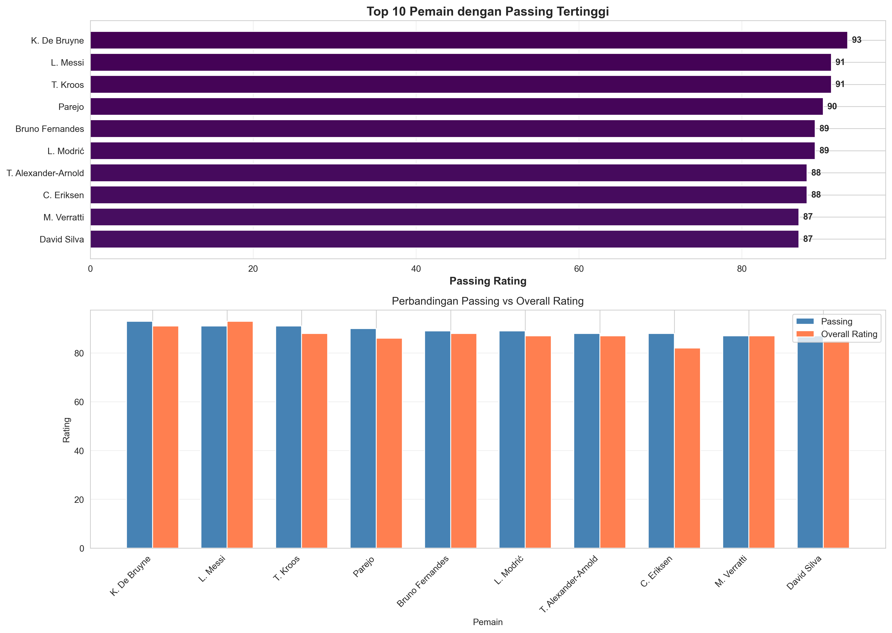
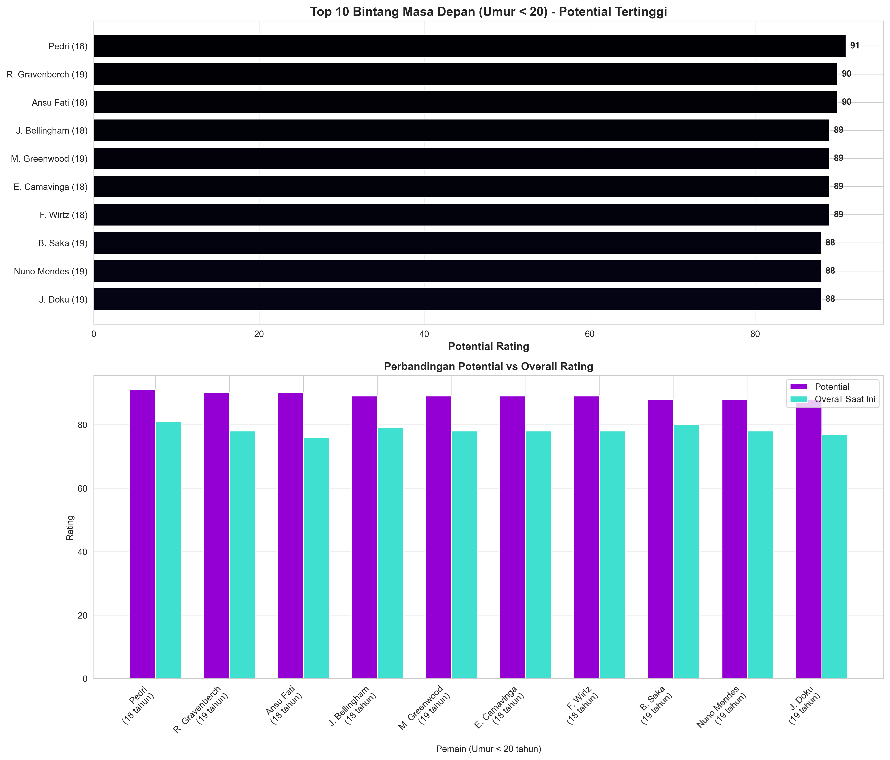

# 📤 Panduan Upload Project ke GitHub

## Step 1: Initialize Git Repository

Buka terminal di folder project dan jalankan:

```bash
cd c:\Users\Kevin\Downloads\FootballDS

# Initialize git
git init

# Add semua file (kecuali yang di .gitignore)
git add .

# Commit pertama
git commit -m "Initial commit: Football Data Science project"
```

## Step 2: Buat Repository di GitHub

1. Buka browser dan login ke [GitHub](https://github.com)
2. Klik tombol **"New"** atau **"+"** di pojok kanan atas
3. Isi detail repository:
   - **Repository name**: `Football-Data-Science` (atau nama lain)
   - **Description**: "Analisis statistik pemain sepak bola menggunakan dataset FIFA 22"
   - **Visibility**: Public atau Private (terserah)
   - **Jangan** centang "Initialize with README" (karena sudah ada)
4. Klik **"Create repository"**

## Step 3: Link dan Push ke GitHub

Setelah repository dibuat, GitHub akan menampilkan perintah. Jalankan:

```bash
# Link dengan remote repository
git remote add origin https://github.com/USERNAME/REPOSITORY_NAME.git

# Ganti USERNAME dan REPOSITORY_NAME dengan yang sesuai
# Contoh: git remote add origin https://github.com/kevin/Football-Data-Science.git

# Push ke GitHub
git branch -M main
git push -u origin main
```

## Step 4: Verifikasi

1. Refresh halaman GitHub repository Anda
2. Semua file seharusnya sudah muncul di repository
3. README.md akan otomatis ditampilkan sebagai deskripsi project

## 🎨 Tips Tambahan

### Editselinay Visualisasi di README

Tambahkan screenshot hasil analisis ke README.md dengan menambahkan:

```markdown
## 🖼️ Hasil Analisis

### Top 10 Passers


### Top 10 Potential U-20

```

### Update File di GitHub

Setelah membuat perubahan:

```bash
git add .
git commit -m "Deskripsi perubahan"
git push
```

### Clone Repository

Untuk download repository di komputer lain:

```bash
git clone https://github.com/USERNAME/REPOSITORY_NAME.git
cd REPOSITORY_NAME
pip install -r requirements.txt
```

## ✅ Checklist

- [x] Project sudah di-initialize dengan git
- [ ] Repository sudah dibuat di GitHub
- [ ] File sudah di-push ke GitHub
- [ ] README sudah diupdate
- [ ] Hasil visualisasi sudah ditampilkan di README

---

**Selamat! Project Anda sudah online di GitHub! 🎉**

